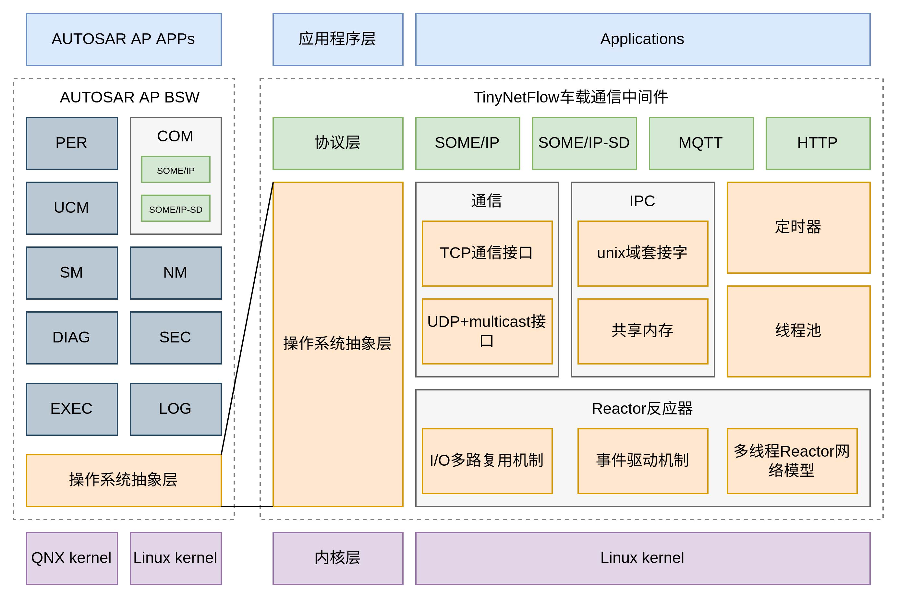
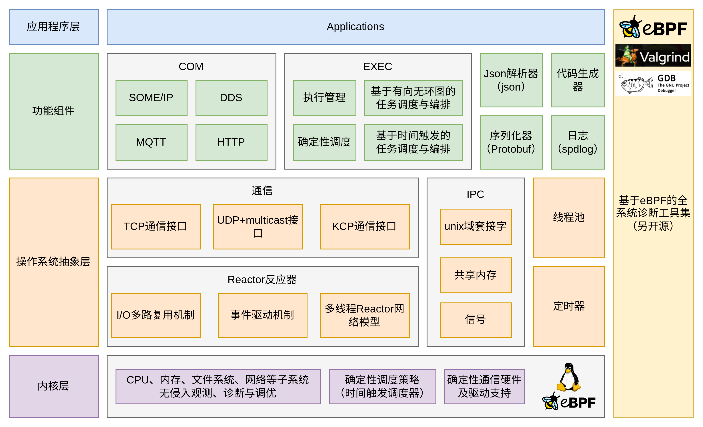
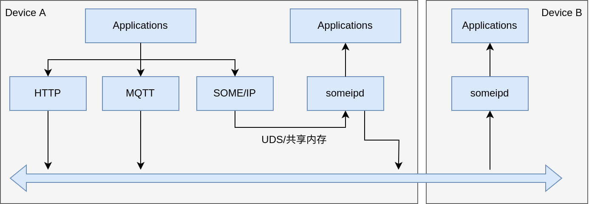
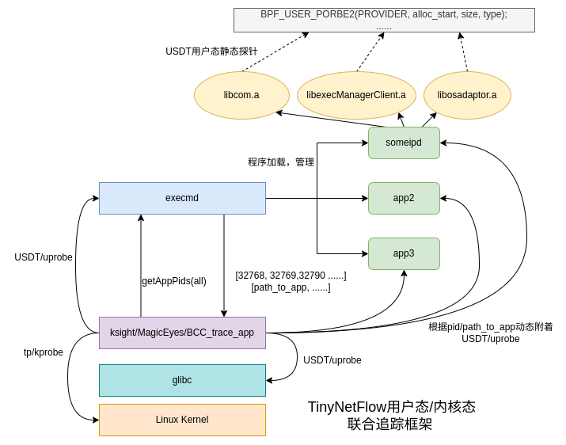

# TinyNetFlow
### 1. 简述

一款轻量级开源车载领域通信中间件。底层采用事件驱动与IO多路复用机制。其具有以下特点：
- C++17标准
- Reactor网络模型
- 不跨平台，只适用于 Linux
- I/O多路复用仅采用 Linux epoll
- IPv4 && IPv6
- TCP服务端/客户端
- 采用2种常见的TCP拆包模式（分界符及头部字段长度）
- [TCP支持心跳、重连、转发]
- UDP服务端/客户端
- 支持UDP组播
- IPC支持unix域套接字&&共享内存
- 支持智能网联汽车中常用的MQTT协议、HTTP协议以及车内网络SOME/IP协议

**代码质量：玩具级** | 咸鱼也要有梦想，谁不是从玩具级开始的呢？
> 玩具级、能用级、工业级、车规级......

### 2. 分层架构



​																				*架构图_一期工程*



​															*架构图_远期*（先把牛吹出去......）


*通信示意图*

### 3. 开发目的

充分发挥C++程序员重复造轮子的精神。哈哈。

- 理解Linux内核网络协议栈 -> 网络编程API -> 网络通信中间件 -> 应用程序， 打通整条脉络，完成功能实现
- 车载领域具有其特殊性，高度安全敏感（功能安全、信息安全）、实时敏感（确定性通信与确定性调度），NetFlow希望可以在这两方面做一些工作，在Linux内核与用户态中采用eBPF技术，实现从内核空间到用户空间的全链路数据观测、诊断与优化。Linux内核与中间件联合开发与优化。

### 4. 构建
依赖
```bash
# USDT/uprobe依赖
# 默认不使能跟踪功能，使能需要安装
sudo apt install systemtap-sdt-dev
```

CMake构建方式
```bash
# 下载
git clone git@github.com:ziyangfu/TinyNetFlow.git
git submodule update --recursive
cd <TinyNetFlow_dir>
# 当前build文件下构建，安装在 build/install文件夹下
sudo ./build_for_Jenkins.sh -n
```

### 5. 例程
在examples文件夹下有TCP、UDP及组播、unix域套接字、共享内存、MQTT、
HTTP以及SOME/IP等相关的演示例程。

运行方法可以参见各个cpp文件置顶部分。

### 6. 安装文件夹目录
```bash
.
├── apps
│   ├── <...>             # 用户程序
├── daemon
│   └── execmd            # 执行管理程序
├── etc
│   └── emConfig.json     # 配置文件
├── include
│   ├── execManagerClient # 头文件
│   └── osadaptor
│   └── com
└── lib
    ├── cmake              # cmake文件 for find_package
    ├── libexecManagerClient.a  # 静态库
    └── libosadaptor.a
    └── libcom.a
└── tests
    ├── osadaptor # 单元测试集
    └── run_all_tests.sh   # 运行所有单元测试
└── trace   # eBPF相关跟踪程序

```
### 7. 关于追踪

### 8. 致谢
- 底层网络库深度参考了 muduo, 感谢陈硕大佬
- MQTT代码参考了 libhv，感谢 ithewei大佬
- SOME/IP参考了 vsomeip

