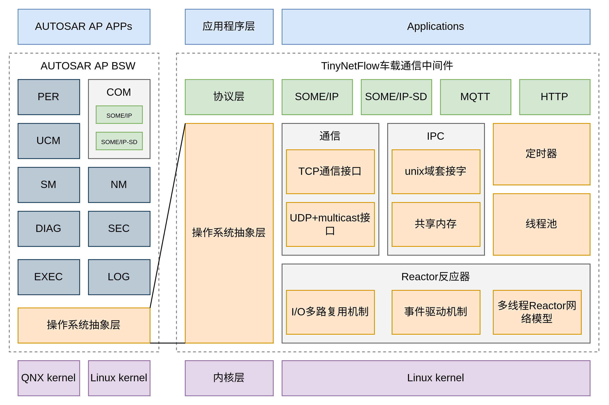

# TinyNetFlow
### 1. 简述

一款轻量级开源车载领域通信中间件。底层采用事件驱动与IO多路复用机制。其具有以下特点：
- C++17标准
- Reactor网络模型
- 不跨平台，只适用于 Linux
- I/O多路复用仅采用 Linux epoll
- IPv4 && IPv6
- TCP服务端/客户端
- 采用2种常见的TCP拆包模式（分界符及头部字段长度）
- [TCP支持心跳、重连、转发]
- UDP服务端/客户端
- 支持UDP组播
- IPC支持unix域套接字&&共享内存
- 支持智能网联汽车中常用的MQTT协议、HTTP协议以及车内网络SOME/IP协议

### 2. 分层架构



​																				*架构图_一期工程*


​															*架构图_远期*（先把牛吹出去......）


*通信示意图*

### 3. 开发目的

充分发挥C++程序员重复造轮子的精神。哈哈。

- 理解Linux内核网络协议栈 -> 网络编程API -> 网络通信中间件 -> 应用程序， 打通整条脉络，完成功能实现
- 车载领域具有其特殊性，高度安全敏感（功能安全、信息安全）、实时敏感（确定性通信与确定性调度），NetFlow希望可以在这两方面做一些工作，在Linux内核与用户态中采用eBPF技术，实现从内核空间到用户空间的全链路数据观测、诊断与优化。Linux内核与中间件联合开发与优化。

### 4. TODO
- [x] Reactor网络模型搭建
- [x] TCP server && client
- [x] UDP server && client， with multicast
- [x] MQTT protocol
- [x] HTTP protocol
- [x] 基于Unix domain socket的进程间通信
- [ ] 基于共享内存的进程间通信【开发中】
- [ ] SOME/IP, SOME/IP-SD【开发中】
- [ ] 使用异步编程promise&&future，参考seastar

### 5. 构建

CMake构建方式

```bash
mkdir build && cd build
cmake ..
make
# option
sudo make install
```

### 6. 例程
在examples文件夹下有TCP、UDP及组播、unix域套接字、共享内存、MQTT、
HTTP以及SOME/IP等相关的演示例程。

运行方法可以参见各个cpp文件置顶部分。
### 7. 致谢
- 底层网络库深度参考了 muduo, 感谢陈硕大佬
- MQTT代码参考了 libhv，感谢 ithewei大佬
- SOME/IP参考了 vsomeip

