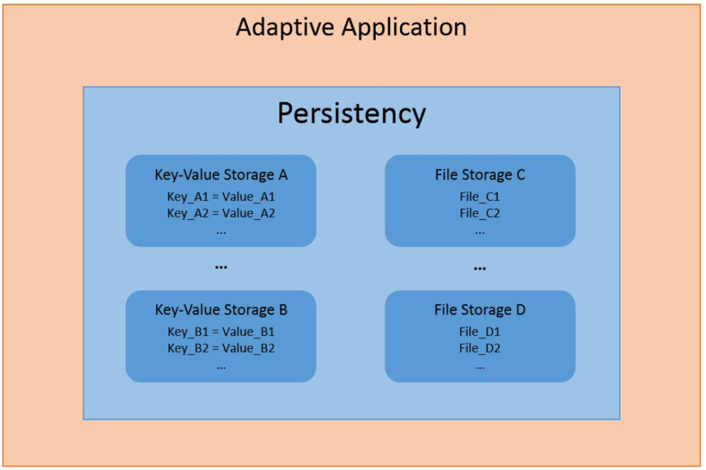

存储库
实现SQL型数据库的封装，例如sqlite3
实现一个 kv型数据库的封装或实现
leveldb

实现对OS 存储的封装，目前对是否有意义存疑

存储存在2个部分，第一个是系统文件系统封装，
这个可以采用 filesystem，以及os的文件接口
第二个部分是数据库部分，采用kv型数据库

是否可以以leveldb为底层kv型数据库，封装成
类似 AP per存储模块的接口？

AUTOSAR per模块提供2种不同的机制来访问磁盘，第一个是k-v型存储，第二个是文件存储，提供
对一组文件的访问

PersistencyKeyValueStorageInterface
PersistencyFileStorageInter‑face

要完成多线程的并发访问问题

安全：在存储时加密，在打开存储时解密
冗余： CRC完整性校验

per API是围绕ara::per::SharedHandle和ara::per::UniqueHandle 设计的，它们由 ara:‑ :per::OpenKeyValueStorage
或ara::per::FileStorage::OpenFileRead‑Write等工厂函数返回。本章中定义的类不能由自适应应用程序直接构造，因此默认构
造函数被视为不可公开访问（即被删除、私有或受保护
